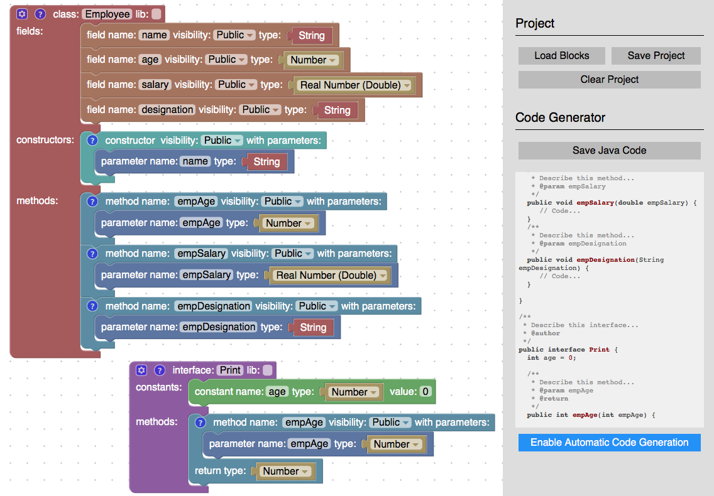

# Сутність класів

> В ООП — **все є об'єктом**.

В об'єктно-орієнтованому програмуванні, **клас** — це спеціальна конструкція, яка **використовується для групування** _пов'язаних змінних та функцій_.
 
- Властивості та методи класу, разом називаються його членами
- При цьому, згідно з термінологією ООП, `глобальні змінні` класу (члени-змінні) називаються `полями даних` (також _властивостями_ або _атрибутами_), а _члени_-`функції` називають `методами класу`. 
- _Створений та ініціалізований_ `екземпляр класу` називають `об'єктом класу` (_реалізацією класу_, `instance`).
- _Сукупність_ значень _атрибутів_ окремого об'єкта називається **станом**.

На основі одного класу можна створити безліч об'єктів, що відрізнятимуться один від одного своїм `станом` (_значеннями_ `полів`).

> http://www.ce.unipr.it/~aferrari/oopp/

> Клас дозволяє задати не лише програмний інтерфейс до самого себе і до своїх екземплярів, але і в явному вигляді написати код, відповідальний за обчислення.

## Об'єкти
Властивості об'єкта визначаються його атрибутами (полями даних). Поточне значення атрибутів визначає поточний стан об'єкта у множині можливих станів.

Поведінка об'єкта визначається функціями (методами) об'єкта. Передача повідомлень між об'єктами (взаємодія об'єктів) призводить до виконання об'єктом, що отримав повідомлення, визначеної функції. Об'єкт також може надіслати повідомлення собі. В результаті отримання об'єктом повідомлення він змінює свій стан: на новий, якщо виконання операцій функції призвело до зміни значень атрибутів; або той самий, якщо атрибути не зазнали змін. В контексті отримання повідомлень та зміни станів об'єкт може розглядатись як [автомат](https://uk.m.wikipedia.org/wiki/Теорія_автоматів).

Властивості об'єкта звичайно доступні лише через його функції при цьому вважається, що об'єкт є екземпляром класу як абстрактного типу даних.

Відповідно до властивостей об'єкта та його стану функції поділяються на конструктори, селектори, модифікатори та деструктори:

- **конструктори** здійснюють первинну ініціалізацію об'єкта при його створенні;
- **селектори** повертають значення окремих властивостей;
- **модифікатори** змінюють значення окремих властивостей;
- **деструктори** скидають значення властивостей при знищенні об'єкта.

Об'єкти звичайно зберігаються в оперативній пам'яті під час виконання програми. При цьому вони представлені в пам'яті послідовністю значень атрибутів — структурою даних. Всі функції об'єктів зберігаються по-за межами об'єктів і для функцій лише забезпечується контекст — можливість звернення до атрибутів вказаного об'єкта.

## Методи
**Ме́тод** в об'єктно-орієнтованому програмуванні — підпрограма (процедура, функція), що використовується виключно разом із класом (методи класу) або з об'єктом (методи екземпляра).

Розрізняють прості методи і статичні методи (методи класу):

- прості методи мають доступ до даних об'єкта (конкретного екземпляра даного класу)
- статичні методи не мають доступу до даних об'єкта і для їх використання не потрібно створювати екземпляри (даного класу).

Залежно від способу використання, методи поділяються на:

- **змістовні** — надаються клієнтам класу і визначають його інтерфейс, звичайно є публічними;
- **спеціальні** — викликаються автоматично при створенні (конструктори), знищенні (деструктори), копіюванні (конструктори копіювання), перетворенні типу тощо;
- **допоміжні** — викликаються з змістовних та спеціальних методів, звичайно не надаються клієнтам класу і є захищеними або приватними.

Залежно від впливу на стан об'єкта, методи поділяються на:

- **конструктори** — встановлюють початковий стан об'єкта;
- **деструктори** — скидають стан об'єкта;
- **селектори** (геттери) — надають значення атрибута;
- **модифікатори** (сеттери) — встановлюють значення атрибута;
- **ітератори** — надають послідовний доступ до множини атрибутів.

***

`@classmethod` означає: коли цей метод викликається, ми передаємо клас як перший аргумент замість екземпляру цього класу (як зазвичай ми робимо з методами). Це означає, що ви можете використовувати клас і його властивості всередині цього методу, а не конкретний екземпляр.

`@staticmethod` означає: коли викликається цей метод, ми не передаємо йому екземпляр класу (як це зазвичай робиться з методами). Це означає, що ви можете помістити функцію всередині класу, але ви не можете отримати доступ до примірника цього класу (це корисно, коли ваш метод не використовує екземпляр).

## Посилання

- [Различия между классом и объектом?](https://toster.ru/q/4847#answer_20947)
- [Сила и красота декораторов](https://habr.com/ru/post/46306/)
- [Значение @classmethod и @staticmethod ](http://qaru.site/questions/10955/meaning-of-classmethod-and-staticmethod-for-beginner)
- [Meaning of @classmethod and @staticmethod](https://stackoverflow.com/questions/12179271/meaning-of-classmethod-and-staticmethod-for-beginner)
- [В чем разница между @staticmethod и @classmethod?](http://qaru.site/questions/385/what-is-the-difference-between-staticmethod-and-classmethod-in-python)
- [What is the difference between @staticmethod and @classmethod?](https://stackoverflow.com/questions/136097/what-is-the-difference-between-staticmethod-and-classmethod)
